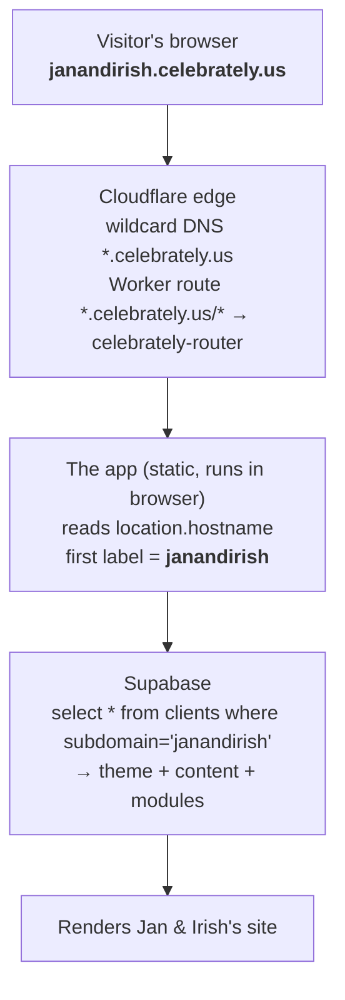

# Multi-tenant routing — how a client URL becomes their site

Every client gets a subdomain like `janandirish.celebrately.us`. There is **one**
deployed app + **one** database; the client is resolved at runtime from the
hostname. Cloudflare is set up **once** with a wildcard and never touched per client.

## Request flow

1. **Browser** — guest opens `janandirish.celebrately.us`; the browser resolves the host via DNS.
2. **Cloudflare edge** — the wildcard record answers *every* subdomain (no per-client DNS). A Worker route forwards the request to the app. *Set up once, never per client.*
3. **App (in the browser)** — the same app loads for everyone. It reads `window.location.hostname`, takes the first label (`janandirish`) — that's the client key. See [`src/lib/tenant.js`](../src/lib/tenant.js).
4. **Supabase** — the app queries the `clients` table by that key, gets the client's theme/content/modules, and renders their site.

## Adding a client (the whole job)

1. Superadmin console → **Clients → Add client**: subdomain, event type, theme, owner email + password.
2. That inserts **one row** in Supabase `clients` (and provisions the owner login via the `admin-create-owner` edge function). **This is the only place the client is stored.**
3. **Cloudflare: nothing.** The wildcard already covers the new subdomain.

Hand the client `https://<subdomain>.celebrately.us` + their login. Done.

> The subdomain → client mapping happens **live in the browser**, by reading the URL and looking it up in Supabase. Cloudflare blindly forwards every `*.celebrately.us` to the same app.

## The pieces

| Piece | Where | Notes |
|---|---|---|
| Platform domain | [`src/config/site.js`](../src/config/site.js) `PLATFORM_DOMAIN` (or `VITE_PLATFORM_DOMAIN`) | display only; resolution is domain-agnostic |
| Subdomain resolution | [`src/lib/tenant.js`](../src/lib/tenant.js) | reads hostname; apex → `demo` |
| Subdomain validation | [`src/config/site.js`](../src/config/site.js) `isValidSubdomain` / `RESERVED_SUBDOMAINS` | enforced in `createClient` |
| Client data | Supabase `clients` table | subdomain, event_type, template_key, content, owner_email |
| App host | Cloudflare Pages project `wedding-site` → `wedding-site-8nh.pages.dev` | built from `main` |
| Edge wildcard | Cloudflare zone `celebrately.us` | `AAAA *` (proxied) + `AAAA @` (proxied) |
| Edge Worker | `celebrately-router` | proxies requests to the Pages origin |
| Worker routes | zone `celebrately.us` | `*.celebrately.us/*` and `celebrately.us/*` |

## Cloudflare wildcard setup (one time, already done)

For domain `celebrately.us` (zone on Cloudflare):

- **DNS**: proxied `AAAA *` and `AAAA @` → `100::` (dummy origin; the Worker handles the response).
- **Worker** `celebrately-router`: reverse-proxies to `wedding-site-8nh.pages.dev`.
- **Routes**: `*.celebrately.us/*` and `celebrately.us/*` → `celebrately-router`.
- **SSL**: Cloudflare Universal SSL covers `celebrately.us` + `*.celebrately.us` (one level) automatically.

## Changing the platform domain

1. Set `VITE_PLATFORM_DOMAIN` in Cloudflare Pages env vars (or edit the fallback in `src/config/site.js`), redeploy.
2. Add the **new** domain to Cloudflare and repeat the wildcard setup above (DNS + Worker route).
3. No change needed in `tenant.js` — it's domain-agnostic.

## Notes / edge cases

- **Apex** (`celebrately.us`) → `tenant.js` returns `demo`, so the bare domain shows the demo client (a hub/marketing slot).
- **A 3-label base domain** (e.g. `poseandclick.it.com`) would break the "apex → demo" assumption — `tenant.js` assumes a 2-label base like `celebrately.us`. Keep the platform on a 2-label domain, or adjust `tenant.js`.
- **Client wants their own domain** (`janandirish.com` instead of a subdomain) → add it as a Cloudflare custom hostname pointing at the app; the app still resolves the client by that hostname's labels.
